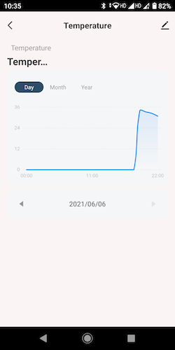
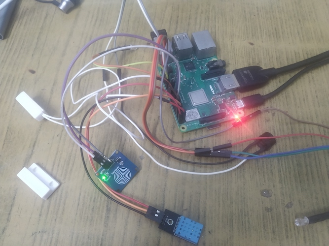

# Farmostat-Tuya-embedded-C-sdk-raspberryPi

> This project is developed using Tuya SDK, which enables you to quickly    develop smart devices, branded APP, cloud development project, etc.
>
>For more information, please check Tuya Developer Click and Connect      Challenge: https://pages.tuya.com/develop/ClickAndConnect_TuyaDeveloper?_source=e9684c7ca6b31e7221c8420f5af94631


## Table of Contents

- [Farmostat-Tuya-embedded-C-sdk-raspberryPi](#Farmostat-Tuya-embedded-C-sdk-raspberryPi)
  - [Table of Contents](#table-of-contents)
  - [Overview](#overview)
  - [Get started](#get-started)
    - [Prerequisites](#prerequisites)
        - [Hardware Required](#Hardware-Required)
        - [Hardware Pin Config](#Hardware-Pin-Config)
        - [Software/Platform](#Software/Platform)
    - [Clone the repository](#clone-the-repository)
    - [Compile the code](#compile-the-code)
    - [Start the program](#start-the-program)
  - [APP Screenshots](#APP-Screenshots)
  - [License](#license)


## Overview
Farmostat is a prototype device built using Raspberry Pi opensource hardware and Tuya embedded C SDK. This device demonstrates **.Tuya IoTOS Link SDK**. core capabilities, such as device connection, uplink and downlink communication, and OTA across platforms and operating systems.
The SDK is implemented in the C programming language and does not depend on the specific device platform and OS environment. It only needs to support the TCP/IP protocol stack and provide the necessary system-dependent interfaces of the SDK to complete the integration.


## Get started

## Prerequisites

## Hardware Required
| Product Name            | Description/Remarks                                                                             | URL                                                                                      |
|-------------------------|-------------------------------------------------------------------------------------------------|------------------------------------------------------------------------------------------|
| Raspberry Pi            | 3B or newer model with Raspbian installed along with power supply, keyboard, monitor, mouse,etc | https://www.raspberrypi.org/products/raspberry-pi-4-model-b/                             |
| Relay board             | 4 relays connecting to Grow Light, UV Light, Exhaust Fan and Sprinkler System                                                                                    | https://www.amazon.com/SunFounder-Channel-Shield-Arduino-Raspberry/dp/B00E0NSORY/        |
| capacitive touch sensor | or any push button                                                                              | https://www.amazon.com/Youliang-Capacitive-Sensor-Switch-Module/dp/B081JK7HCJ            |
| Reed Sensor             | Magnetic door lock sensor                                                                       | https://www.amazon.com/Magnetic-Normally-Security-Contact-white-M38/dp/B091GFZYB8        |
| DHT11 Sesnor            | Temperature Sensor                                                                              | https://www.amazon.com/HiLetgo-Temperature-Humidity-Digital-3-3V-5V/dp/B01DKC2GQ0/       |
| Buzzer/Alarm            | 5v buzzer                                                                                       | https://www.amazon.com/Cylewet-Electronic-Sounder-Continuous-Intermittent/dp/B075PT19J2/ |

## Hardware Pin Config
| Device                          | GPIO Number |
|---------------------------------|-------------|
| Door Sensor                     | 0           |
| Capacitive Touch Sensor/ Switch | 2           |
| Relay 1/ UV LED                 | 6           |
| DHT 11 Sensor                   | 7           |
| ALARM                           | 26          |
| Relay 2/ Fan                    | 27          |
| Relay 3/ Grow Light             | 28          |
| Relay 4/Sprinkler               | 29          |

### Software/Platform
Ubuntu and Debian
```sh
sudo apt-get install make cmake libqrencode-dev
```

### Clone the repository
```sh
git clone https://github.com/sasidharankp/tuya-iot-device-sdk-C-v1.git 
```
>Replace product key, id and auth key in farmostat/tuya_config.h with key obtained from tuya developer console
### Compile the code
```sh
mkdir build && cd build
cmake ..
make
```

### Start the program
```sh
./bin/farmostat
```

## APP Screenshots
 

### bare minimum debugging prototype

## License

Distributed under the MIT License. For more information, see `LICENSE`.
