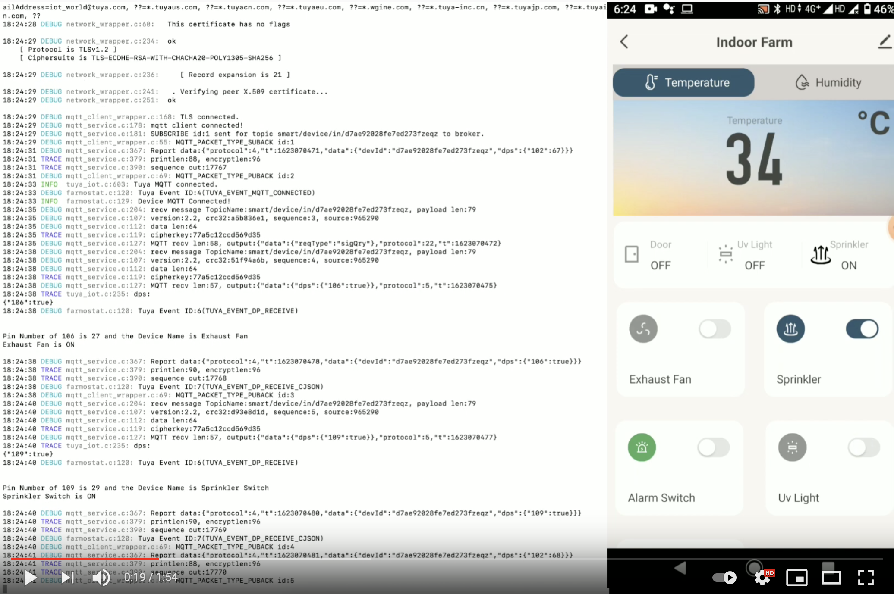
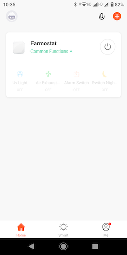
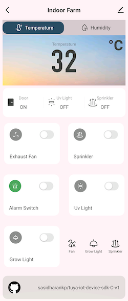
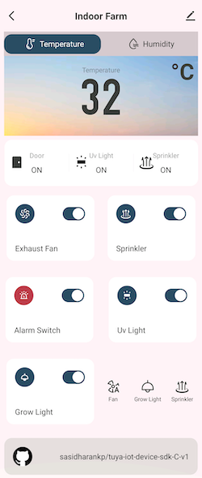
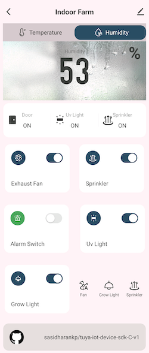
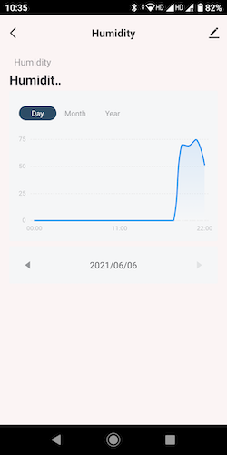
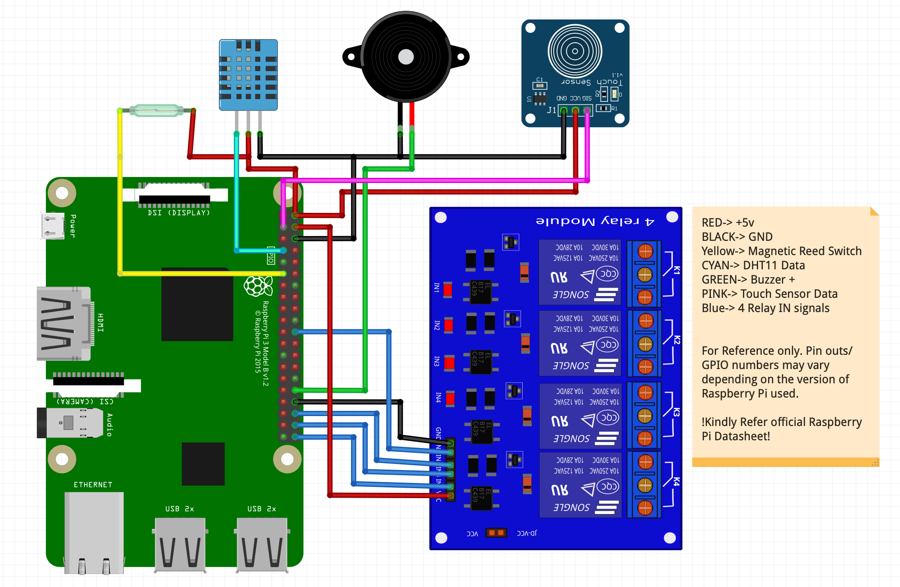

# Farmostat Tuya-embedded-C-sdk-raspberryPi

> This project is developed using Tuya SDK, which enables you to quickly    develop smart devices, branded APP, cloud development project, etc.
>
>For more information, please check Tuya Developer Click and Connect      Challenge: https://pages.tuya.com/develop/ClickAndConnect_TuyaDeveloper?_source=e9684c7ca6b31e7221c8420f5af94631


## Table of Contents

- [Farmostat-Tuya-embedded-C-sdk-raspberryPi](#Farmostat-Tuya-embedded-C-sdk-raspberryPi)
  - [Table of Contents](#table-of-contents)
  - [Overview](#overview)
  - [Get started](#get-started)
    - [Prerequisites](#prerequisites)
        - [Hardware Required](#Hardware-Required)
        - [Hardware Pin Config](#Hardware-Pin-Config)
        - [Software/Platform](#Software/Platform)
    - [Clone the repository](#clone-the-repository)
    - [Compile the code](#compile-the-code)
    - [Start the program](#start-the-program)
  - [Usage Example](#Usage-Example)
    - [Youtube Video](#Youtube-Video)
    - [APP Screenshots](#APP-Screenshots)
  - [License](#license)


## Overview
Farmostat is a prototype device built using Raspberry Pi opensource hardware and Tuya embedded C SDK. This device demonstrates **.Tuya IoTOS Link SDK**. core capabilities, such as device connection, uplink and downlink communication, and OTA across platforms and operating systems.
The SDK is implemented in the C programming language and does not depend on the specific device platform and OS environment. It only needs to support the TCP/IP protocol stack and provide the necessary system-dependent interfaces of the SDK to complete the integration.


## Get started

## Prerequisites

## Hardware Required
| Product Name            | Description/Remarks                                                                             | URL                                                                                      |
|-------------------------|-------------------------------------------------------------------------------------------------|------------------------------------------------------------------------------------------|
| Raspberry Pi            | 3B or newer model with Raspbian installed along with power supply, keyboard, monitor, mouse,etc | https://www.raspberrypi.org/products/raspberry-pi-4-model-b/                             |
| Relay board             | 4 relays connecting to Grow Light, UV Light, Exhaust Fan and Sprinkler System                                                                                    | https://www.amazon.com/SunFounder-Channel-Shield-Arduino-Raspberry/dp/B00E0NSORY/        |
| capacitive touch sensor | or any push button                                                                              | https://www.amazon.com/Youliang-Capacitive-Sensor-Switch-Module/dp/B081JK7HCJ            |
| Reed Sensor             | Magnetic door lock sensor                                                                       | https://www.amazon.com/Magnetic-Normally-Security-Contact-white-M38/dp/B091GFZYB8        |
| DHT11 Sesnor            | Temperature Sensor                                                                              | https://www.amazon.com/HiLetgo-Temperature-Humidity-Digital-3-3V-5V/dp/B01DKC2GQ0/       |
| Buzzer/Alarm            | 5v buzzer                                                                                       | https://www.amazon.com/Cylewet-Electronic-Sounder-Continuous-Intermittent/dp/B075PT19J2/ |

## Hardware Pin Config
| Device                          | GPIO Number | Data Point |
|---------------------------------|-------------|------------|
| Door Sensor                     | 0           | 103        |
| Capacitive Touch Sensor/ Switch | 2           | 104        |
| Relay 1/ UV LED                 | 6           | 105        |
| DHT 11 Sensor                   | 7           | 101, 102   |
| ALARM                           | 26          | 107        |
| Relay 2/ Fan                    | 27          | 106        |
| Relay 3/ Grow Light             | 28          | 108        |
| Relay 4/Sprinkler               | 29          | 109        |

### Software/Platform
**Ubuntu and Debian**
```sh
sudo apt-get install make cmake libqrencode-dev
```

**Install WiringPi Library**
```sh
sudo apt-get install wiringpi
```
verify WiringPi
```sh
gpio -v
```
To get GPIO numbers of raspberr
```sh
gpio readall
```

### Clone the repository
```sh
git clone https://github.com/sasidharankp/tuya-iot-device-sdk-C-v1.git 
```
>Replace product key, id and auth key in farmostat/tuya_config.h with key obtained from tuya developer console
### Compile the code
```sh
mkdir build && cd build
cmake ..
make
```

### Start the program
```sh
./bin/farmostat
```
## Usage Example
This is a demonstration of how to use raspberry pi to connect to Tuya cloud using Tuya Embedded SDK and get the benifits of IoT with minimal coding instead of developing from the scratch.

The use case I have chosen covers some examples of basic sensors and actuators that are usually interfaced with IoT devices. The Farmostat device can be used to control and sense the physical parameters of an indoor farm.

> It can read and report real time **Temperature** and **Humidity** data to the mobile app
>
> can sense the door status in real time
>
> Manually Control the sprinklers from the app or automate it using smart Automations. For example *Turn on Sprinkler when temperature above 30 and humidity below 40*
>
> Turn on UV lights to sterilize the environment and prevent harmfull pests
>
> Automate to Turn OFF UV LIGHTS if the Door is Open
>
> Turn on alarm if sprinkler is turned on when Door is Open
>
> Turn on Exhaust fan manually or automate to turn on whe temperature is high
>
> Turn on Grow Lights everyday after sunset and turn off during sunrise
>
> Even Sky is not the limit. Come up with your own ideas to automate and have fun


Farmostat can be interfaced with 
  - 3 sensors
    - DHT 11 temperature and Humidity Sensor
    - Touch Sensor or any push button
    - Magnetic Door Lock Sensor
  - 5 actuators
    - 4-Ch Relay Module
      - Relay 1 - Exhaust Fan
      - Relay 2 - UV Light
      - Relay 3 - Grow Light
      - Relay 4 - Sprinkler
    - Buzzer/ Alarm

>For information on data points refer [Hardware Pin Config](#Hardware-Pin-Config)
> 
>WiringPi Documentation [WiringPi Documentation](http://wiringpi.com/reference/setup/)
>
>For Information on creating app in Tuya Cloud - [Instructions](https://developer.tuya.com/en/demo/link-sdk-demo-raspberry-pi)
>
>Tuya SDK documentation [SDK Documentation](https://developer.tuya.com/en/docs/iot/tuya-crossplatform-link-cloud-sdk-instructions?id=K9muru498u4um)
>
>Tuya IoT Cloud - [Dashboard](https://iot.tuya.com/index/)
### Youtube Video
>[Youtube Video](https://youtu.be/trXw7ldgrqs)
[](https://youtu.be/trXw7ldgrqs)

### APP Screenshots
 



### Schematic(For Reference only)

## License

Distributed under the MIT License. For more information, see `LICENSE`.
